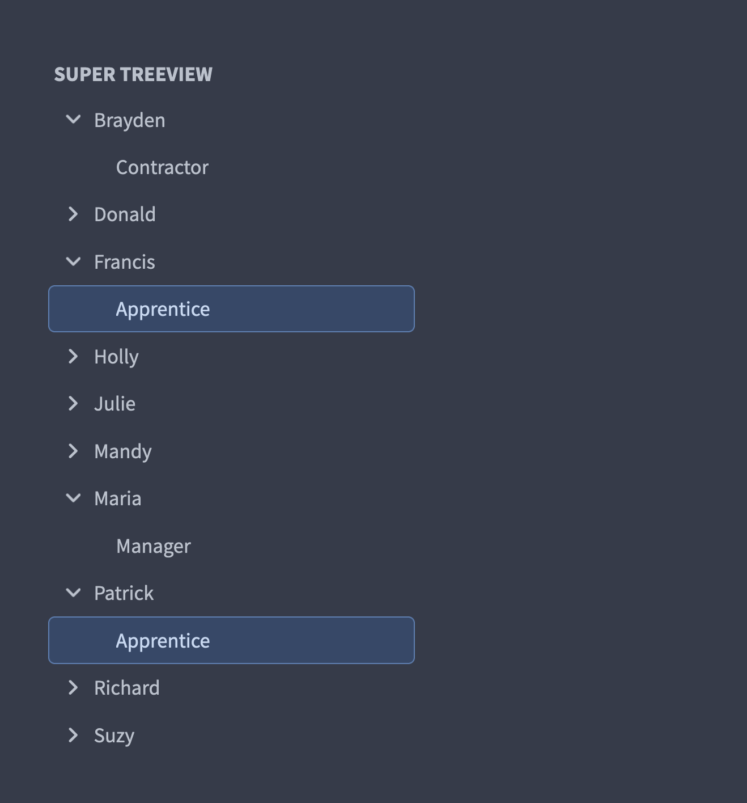
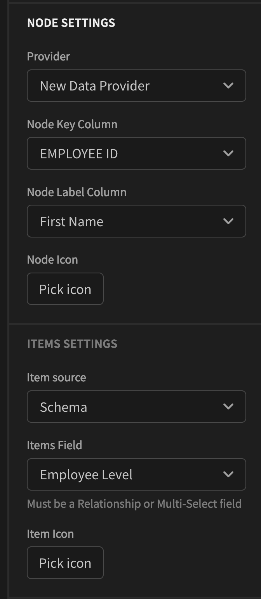

# bb-component-SuperTreeView
The Super Treeview component allows you to create beatiful selectable Master Detail Treeviews.
The component can render any Relationtship or Multi-Select (array) field as child items to parent Nodes.





# Description
A TreeView Component for Budibase with Super Powers !




Find out more about [Budibase](https://github.com/Budibase/budibase).

## Instructions

To build your new  plugin run the following in your Budibase CLI:
```
budi plugins --build
```

You can also re-build everytime you make a change to your plugin with the command:
```
budi plugins --watch
```

